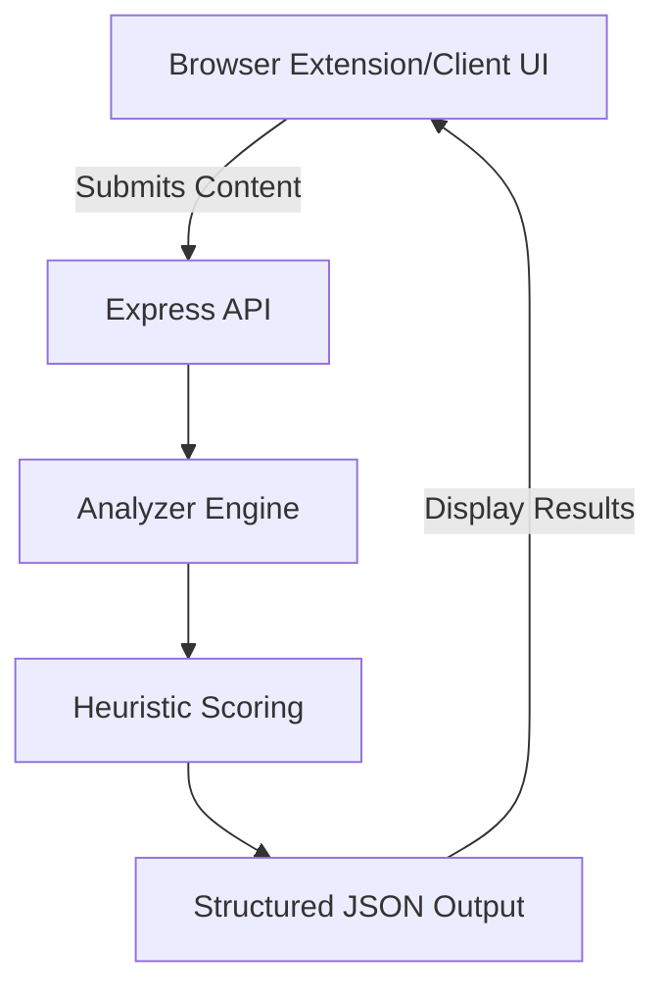

# PsyWall: Technical Stack & Architecture

## 🚀 Overview
**PsyWall** (Cognitive Firewall) is a modular security engine designed to detect and mitigate cognitive attacks, such as phishing and social engineering, using a combination of heuristic scoring and real-time content analysis.

---

## 💻 Frontend (Client)
The frontend is built for visual impact and high fidelity, following modern "Visual Excellence" principles.

### **Core Frameworks**
*   **React 19**: Utilizing the latest React features for efficient state management and component lifecycle.
*   **Vite**: Next-generation frontend tooling for rapid development and optimized production builds.

### **Styling & UI**
*   **Tailwind CSS 4.0**: A utility-first CSS framework integrated with Vite for high-performance styling.
*   **Lucide React**: Modern, consistent icon set.

### **Visual Effects (The "Wow" Factor)**
*   **Three.js**: Low-level 3D graphics library.
*   **React Three Fiber (R3F)** & **Drei**: React-based abstractions for Three.js, used for the "Liquid Ether" and "Floating Lines" background effects.
*   **Framer Motion**: Comprehensive animation library for fluid UI transitions and micro-interactions.

---

## ⚙️ Backend (Server)
The backend serves as the core "Analyzer Engine," processing data from the browser extension or UI.

### **Core Engine**
*   **Node.js & Express**: High-performance runtime and web framework.
*   **Modular Architecture**: Follows the pattern: `API → Analyzer Engine → Scoring → Structured JSON`.

### **Security & Sanitization**
*   **Helmet**: Sets secure HTTP headers.
*   **Express Rate Limit**: Protects the API from abuse.
*   **CORS**: Ensures secure cross-origin resource sharing.
*   **DOMPurify & jsdom**: Used for safe, server-side parsing and analysis of HTML/URL content to detect phishing indicators.

---

## 🧪 Development & Testing
*   **Testing**: **Vitest** (modern testing framework) and **Supertest** (API testing).
*   **Linting**: **ESLint** with React-specific configurations.
*   **Environment**: Managed via `dotenv` and a structured `config` module.

---

## 🏛️ System Flow

